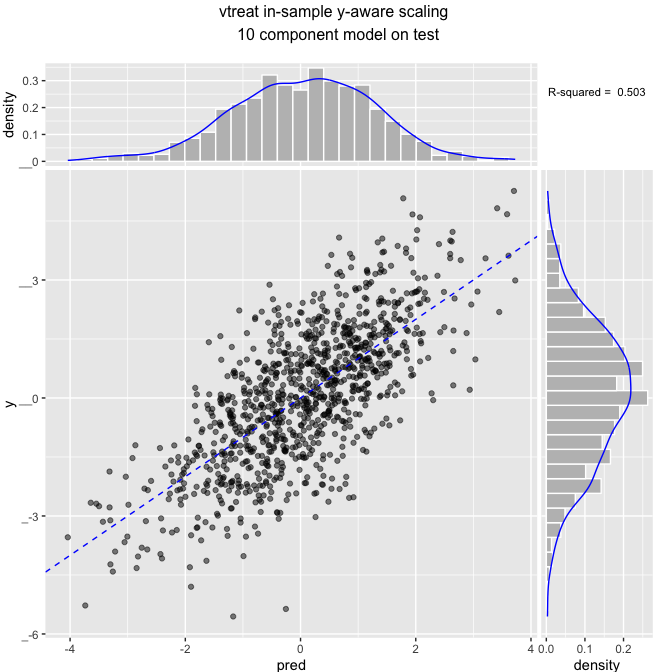

``` r
# see: http://www.win-vector.com/blog/2016/05/pcr_part2_yaware/
# build example where even and odd variables are bringing in noisy images
# of two different signals.
mkData <- function(n) {
  for(group in 1:10) {
    # y is the sum of two effects yA and yB
    yA <- rnorm(n)
    yB <- rnorm(n)
    if(group==1) {
      d <- data.frame(y=yA+yB+rnorm(n))
      code <- 'x'
    } else {
      code <- paste0('noise',group-1)
    }
    yS <- list(yA,yB)
    # these variables are correlated with y in in group 1
    for(i in 1:5) {
      vi <- yS[[1+(i%%2)]] + rnorm(nrow(d))
      d[[paste(code,formatC(i,width=2,flag=0),sep='.')]] <-  ncol(d)*vi
    }
  }
  d
}
```

``` r
# make data
set.seed(23525)
dTrain <- mkData(1000)
dTest <- mkData(1000)
```

    ## [1] 50

    ## [1] "std x-only scaling"
    ## [1] "*******************************************"
    ## [1] "x-only scaling"
    ##       x.01               x.02               x.03         
    ##  Min.   :-3.56466   Min.   :-3.53178   Min.   :-3.30810  
    ##  1st Qu.:-0.71922   1st Qu.:-0.68546   1st Qu.:-0.69234  
    ##  Median : 0.01428   Median : 0.02157   Median :-0.01868  
    ##  Mean   : 0.00000   Mean   : 0.00000   Mean   : 0.00000  
    ##  3rd Qu.: 0.64729   3rd Qu.: 0.64710   3rd Qu.: 0.68890  
    ##  Max.   : 3.02949   Max.   : 3.44983   Max.   : 3.53463  
    ##       x.04                x.05            noise1.01       
    ##  Min.   :-3.024649   Min.   :-3.44403   Min.   :-3.55505  
    ##  1st Qu.:-0.669618   1st Qu.:-0.70737   1st Qu.:-0.67730  
    ##  Median : 0.003458   Median :-0.02962   Median : 0.04075  
    ##  Mean   : 0.000000   Mean   : 0.00000   Mean   : 0.00000  
    ##  3rd Qu.: 0.679310   3rd Qu.: 0.69119   3rd Qu.: 0.66476  
    ##  Max.   : 3.618095   Max.   : 3.25413   Max.   : 3.03398  
    ##    noise1.02          noise1.03          noise1.04       
    ##  Min.   :-3.04344   Min.   :-3.24553   Min.   :-3.17058  
    ##  1st Qu.:-0.67283   1st Qu.:-0.67685   1st Qu.:-0.66255  
    ##  Median :-0.01098   Median :-0.04143   Median : 0.02303  
    ##  Mean   : 0.00000   Mean   : 0.00000   Mean   : 0.00000  
    ##  3rd Qu.: 0.63123   3rd Qu.: 0.66017   3rd Qu.: 0.68567  
    ##  Max.   : 3.09969   Max.   : 3.46234   Max.   : 3.30193  
    ##    noise1.05           noise2.01          noise2.02       
    ##  Min.   :-3.637258   Min.   :-3.02967   Min.   :-3.11067  
    ##  1st Qu.:-0.716404   1st Qu.:-0.67137   1st Qu.:-0.67677  
    ##  Median :-0.009741   Median :-0.02374   Median :-0.03242  
    ##  Mean   : 0.000000   Mean   : 0.00000   Mean   : 0.00000  
    ##  3rd Qu.: 0.669438   3rd Qu.: 0.61202   3rd Qu.: 0.67432  
    ##  Max.   : 2.989022   Max.   : 2.69382   Max.   : 3.56327  
    ##    noise2.03          noise2.04          noise2.05       
    ##  Min.   :-3.32724   Min.   :-2.96915   Min.   :-3.01326  
    ##  1st Qu.:-0.69209   1st Qu.:-0.66348   1st Qu.:-0.67107  
    ##  Median : 0.01705   Median :-0.03646   Median :-0.02221  
    ##  Mean   : 0.00000   Mean   : 0.00000   Mean   : 0.00000  
    ##  3rd Qu.: 0.67707   3rd Qu.: 0.63654   3rd Qu.: 0.68463  
    ##  Max.   : 3.64146   Max.   : 3.24450   Max.   : 3.12544  
    ##    noise3.01          noise3.02          noise3.03       
    ##  Min.   :-3.37021   Min.   :-2.90826   Min.   :-5.26300  
    ##  1st Qu.:-0.61175   1st Qu.:-0.67123   1st Qu.:-0.63535  
    ##  Median :-0.01631   Median :-0.01888   Median : 0.03451  
    ##  Mean   : 0.00000   Mean   : 0.00000   Mean   : 0.00000  
    ##  3rd Qu.: 0.63991   3rd Qu.: 0.68101   3rd Qu.: 0.64866  
    ##  Max.   : 3.13484   Max.   : 3.36663   Max.   : 3.49695  
    ##    noise3.04          noise3.05          noise4.01        
    ##  Min.   :-3.17697   Min.   :-3.30323   Min.   :-3.331686  
    ##  1st Qu.:-0.68534   1st Qu.:-0.63505   1st Qu.:-0.672998  
    ##  Median : 0.01006   Median : 0.02726   Median :-0.003899  
    ##  Mean   : 0.00000   Mean   : 0.00000   Mean   : 0.000000  
    ##  3rd Qu.: 0.71201   3rd Qu.: 0.64763   3rd Qu.: 0.678726  
    ##  Max.   : 2.80253   Max.   : 3.25230   Max.   : 3.672058  
    ##    noise4.02          noise4.03          noise4.04        
    ##  Min.   :-3.40526   Min.   :-3.50868   Min.   :-2.850585  
    ##  1st Qu.:-0.65631   1st Qu.:-0.67795   1st Qu.:-0.642033  
    ##  Median :-0.02656   Median :-0.02249   Median :-0.003927  
    ##  Mean   : 0.00000   Mean   : 0.00000   Mean   : 0.000000  
    ##  3rd Qu.: 0.71619   3rd Qu.: 0.69348   3rd Qu.: 0.666246  
    ##  Max.   : 3.14709   Max.   : 3.01486   Max.   : 2.822614  
    ##    noise4.05          noise5.01          noise5.02       
    ##  Min.   :-2.88875   Min.   :-3.28356   Min.   :-2.77919  
    ##  1st Qu.:-0.68111   1st Qu.:-0.66186   1st Qu.:-0.68516  
    ##  Median :-0.02164   Median : 0.01031   Median :-0.01818  
    ##  Mean   : 0.00000   Mean   : 0.00000   Mean   : 0.00000  
    ##  3rd Qu.: 0.68861   3rd Qu.: 0.68392   3rd Qu.: 0.65803  
    ##  Max.   : 2.99364   Max.   : 3.59664   Max.   : 2.86640  
    ##    noise5.03           noise5.04           noise5.05       
    ##  Min.   :-3.141748   Min.   :-3.372903   Min.   :-3.00261  
    ##  1st Qu.:-0.668289   1st Qu.:-0.664215   1st Qu.:-0.69759  
    ##  Median : 0.001024   Median : 0.004278   Median : 0.01208  
    ##  Mean   : 0.000000   Mean   : 0.000000   Mean   : 0.00000  
    ##  3rd Qu.: 0.694700   3rd Qu.: 0.666247   3rd Qu.: 0.69230  
    ##  Max.   : 2.882415   Max.   : 3.004999   Max.   : 2.79255  
    ##    noise6.01          noise6.02           noise6.03       
    ##  Min.   :-3.34363   Min.   :-3.457442   Min.   :-3.17042  
    ##  1st Qu.:-0.66990   1st Qu.:-0.614116   1st Qu.:-0.68510  
    ##  Median : 0.02551   Median : 0.007875   Median :-0.02421  
    ##  Mean   : 0.00000   Mean   : 0.000000   Mean   : 0.00000  
    ##  3rd Qu.: 0.70390   3rd Qu.: 0.644664   3rd Qu.: 0.66523  
    ##  Max.   : 2.76494   Max.   : 3.101829   Max.   : 3.36585  
    ##    noise6.04           noise6.05          noise7.01       
    ##  Min.   :-3.383278   Min.   :-3.08557   Min.   :-2.81094  
    ##  1st Qu.:-0.689616   1st Qu.:-0.67565   1st Qu.:-0.70652  
    ##  Median :-0.005454   Median : 0.02158   Median : 0.03228  
    ##  Mean   : 0.000000   Mean   : 0.00000   Mean   : 0.00000  
    ##  3rd Qu.: 0.685594   3rd Qu.: 0.66487   3rd Qu.: 0.67877  
    ##  Max.   : 2.844464   Max.   : 2.93981   Max.   : 3.43567  
    ##    noise7.02           noise7.03          noise7.04       
    ##  Min.   :-3.219500   Min.   :-3.75066   Min.   :-2.82669  
    ##  1st Qu.:-0.705328   1st Qu.:-0.67748   1st Qu.:-0.66636  
    ##  Median : 0.002837   Median : 0.03481   Median :-0.02026  
    ##  Mean   : 0.000000   Mean   : 0.00000   Mean   : 0.00000  
    ##  3rd Qu.: 0.676359   3rd Qu.: 0.68288   3rd Qu.: 0.65232  
    ##  Max.   : 3.478201   Max.   : 2.78215   Max.   : 3.22680  
    ##    noise7.05          noise8.01          noise8.02       
    ##  Min.   :-2.87974   Min.   :-3.15106   Min.   :-3.36337  
    ##  1st Qu.:-0.66995   1st Qu.:-0.69851   1st Qu.:-0.72149  
    ##  Median :-0.01265   Median : 0.03405   Median :-0.04337  
    ##  Mean   : 0.00000   Mean   : 0.00000   Mean   : 0.00000  
    ##  3rd Qu.: 0.69144   3rd Qu.: 0.67439   3rd Qu.: 0.68424  
    ##  Max.   : 3.46219   Max.   : 3.31936   Max.   : 2.84291  
    ##    noise8.03          noise8.04         noise8.05       
    ##  Min.   :-2.97938   Min.   :-2.7641   Min.   :-2.78277  
    ##  1st Qu.:-0.69513   1st Qu.:-0.7185   1st Qu.:-0.70907  
    ##  Median : 0.02208   Median :-0.0125   Median : 0.03003  
    ##  Mean   : 0.00000   Mean   : 0.0000   Mean   : 0.00000  
    ##  3rd Qu.: 0.68959   3rd Qu.: 0.7405   3rd Qu.: 0.68615  
    ##  Max.   : 3.14059   Max.   : 2.9476   Max.   : 2.92697  
    ##    noise9.01           noise9.02           noise9.03        
    ##  Min.   :-2.869517   Min.   :-3.214109   Min.   :-3.112908  
    ##  1st Qu.:-0.697756   1st Qu.:-0.675945   1st Qu.:-0.681257  
    ##  Median : 0.002377   Median : 0.002854   Median :-0.008767  
    ##  Mean   : 0.000000   Mean   : 0.000000   Mean   : 0.000000  
    ##  3rd Qu.: 0.674219   3rd Qu.: 0.634927   3rd Qu.: 0.694086  
    ##  Max.   : 2.852684   Max.   : 3.250219   Max.   : 3.438842  
    ##    noise9.04          noise9.05       
    ##  Min.   :-3.53174   Min.   :-3.92015  
    ##  1st Qu.:-0.65046   1st Qu.:-0.68052  
    ##  Median :-0.01833   Median : 0.02028  
    ##  Mean   : 0.00000   Mean   : 0.00000  
    ##  3rd Qu.: 0.66983   3rd Qu.: 0.65494  
    ##  Max.   : 3.47310   Max.   : 3.11200  
    ## 
    ## Call:
    ## lm(formula = formula, data = projectedTrain)
    ## 
    ## Residuals:
    ##     Min      1Q  Median      3Q     Max 
    ## -4.4461 -0.9468  0.0313  0.9553  4.9620 
    ## 
    ## Coefficients:
    ##             Estimate Std. Error t value Pr(>|t|)    
    ## (Intercept)  0.08504    0.04783   1.778 0.075724 .  
    ## PC1         -0.10702    0.03141  -3.407 0.000684 ***
    ## PC2         -0.04793    0.03181  -1.507 0.132183    
    ## PC3         -0.13593    0.03222  -4.219 2.68e-05 ***
    ## PC4         -0.16234    0.03250  -4.995 6.94e-07 ***
    ## PC5          0.35688    0.03325  10.734  < 2e-16 ***
    ## PC6          0.12649    0.03343   3.783 0.000164 ***
    ## PC7          0.09255    0.03411   2.713 0.006786 ** 
    ## PC8         -0.13425    0.03475  -3.863 0.000119 ***
    ## PC9          0.28013    0.03516   7.967 4.46e-15 ***
    ## PC10         0.11262    0.03543   3.179 0.001523 ** 
    ## ---
    ## Signif. codes:  0 '***' 0.001 '**' 0.01 '*' 0.05 '.' 0.1 ' ' 1
    ## 
    ## Residual standard error: 1.513 on 989 degrees of freedom
    ## Multiple R-squared:  0.2219, Adjusted R-squared:  0.214 
    ## F-statistic:  28.2 on 10 and 989 DF,  p-value: < 2.2e-16


    ## [1] "train rsq 0.221881172515066"


    ## [1] "test rsq 0.26396282224084"
    ## 
    ## Call:
    ## lm(formula = formula, data = projectedTrainX)
    ## 
    ## Residuals:
    ##     Min      1Q  Median      3Q     Max 
    ## -4.1926 -1.0522  0.0082  1.0251  5.6872 
    ## 
    ## Coefficients:
    ##             Estimate Std. Error t value Pr(>|t|)    
    ## (Intercept)  0.08783    0.05054   1.738 0.082535 .  
    ## PC1         -0.12992    0.03752  -3.463 0.000557 ***
    ## PC2         -0.09055    0.03670  -2.467 0.013795 *  
    ## PC3         -0.07856    0.03697  -2.125 0.033847 *  
    ## PC4         -0.15607    0.03467  -4.502 7.53e-06 ***
    ## PC5          0.27168    0.03723   7.297 6.05e-13 ***
    ## PC6          0.13367    0.03751   3.564 0.000383 ***
    ## PC7          0.15881    0.03637   4.367 1.39e-05 ***
    ## PC8         -0.03533    0.03770  -0.937 0.348976    
    ## PC9          0.15971    0.03717   4.296 1.91e-05 ***
    ## PC10         0.08733    0.03654   2.390 0.017052 *  
    ## ---
    ## Signif. codes:  0 '***' 0.001 '**' 0.01 '*' 0.05 '.' 0.1 ' ' 1
    ## 
    ## Residual standard error: 1.595 on 989 degrees of freedom
    ## Multiple R-squared:  0.1344, Adjusted R-squared:  0.1256 
    ## F-statistic: 15.35 on 10 and 989 DF,  p-value: < 2.2e-16


    ## [1] "train rsq 0.134358541014939"


    ## [1] "test rsq 0.235021411151901"
    ## [1] "using direct method"
    ## [1] "*******************************************"
    ## [1] "in-sample y-aware scaling"
    ##       x.01               x.02               x.03         
    ##  Min.   :-2.65396   Min.   :-2.51975   Min.   :-2.14566  
    ##  1st Qu.:-0.53547   1st Qu.:-0.48904   1st Qu.:-0.44906  
    ##  Median : 0.01063   Median : 0.01539   Median :-0.01211  
    ##  Mean   : 0.00000   Mean   : 0.00000   Mean   : 0.00000  
    ##  3rd Qu.: 0.48192   3rd Qu.: 0.46167   3rd Qu.: 0.44683  
    ##  Max.   : 2.25552   Max.   : 2.46128   Max.   : 2.29259  
    ##       x.04                x.05            noise1.01       
    ##  Min.   :-2.157010   Min.   :-2.11879   Min.   :-0.24249  
    ##  1st Qu.:-0.477534   1st Qu.:-0.43518   1st Qu.:-0.04620  
    ##  Median : 0.002466   Median :-0.01822   Median : 0.00278  
    ##  Mean   : 0.000000   Mean   : 0.00000   Mean   : 0.00000  
    ##  3rd Qu.: 0.484445   3rd Qu.: 0.42523   3rd Qu.: 0.04534  
    ##  Max.   : 2.580222   Max.   : 2.00196   Max.   : 0.20695  
    ##    noise1.02            noise1.03            noise1.04         
    ##  Min.   :-0.0917910   Min.   :-0.0785730   Min.   :-0.0162697  
    ##  1st Qu.:-0.0186927   1st Qu.:-0.0149815   1st Qu.:-0.0033998  
    ##  Median : 0.0003253   Median : 0.0009402   Median : 0.0001182  
    ##  Mean   : 0.0000000   Mean   : 0.0000000   Mean   : 0.0000000  
    ##  3rd Qu.: 0.0199244   3rd Qu.: 0.0153602   3rd Qu.: 0.0035185  
    ##  Max.   : 0.0901253   Max.   : 0.0736528   Max.   : 0.0169437  
    ##    noise1.05            noise2.01           noise2.02         
    ##  Min.   :-0.0679766   Min.   :-0.173381   Min.   :-2.052e-03  
    ##  1st Qu.:-0.0152244   1st Qu.:-0.038421   1st Qu.:-3.884e-04  
    ##  Median : 0.0002215   Median :-0.001359   Median : 1.867e-05  
    ##  Mean   : 0.0000000   Mean   : 0.000000   Mean   : 0.000e+00  
    ##  3rd Qu.: 0.0162925   3rd Qu.: 0.035024   3rd Qu.: 3.898e-04  
    ##  Max.   : 0.0827189   Max.   : 0.154162   Max.   : 1.792e-03  
    ##    noise2.03            noise2.04            noise2.05         
    ##  Min.   :-1.794e-02   Min.   :-0.0163329   Min.   :-0.0165502  
    ##  1st Qu.:-3.335e-03   1st Qu.:-0.0036497   1st Qu.:-0.0036253  
    ##  Median :-8.396e-05   Median :-0.0002006   Median : 0.0001176  
    ##  Mean   : 0.000e+00   Mean   : 0.0000000   Mean   : 0.0000000  
    ##  3rd Qu.: 3.409e-03   3rd Qu.: 0.0035015   3rd Qu.: 0.0035535  
    ##  Max.   : 1.639e-02   Max.   : 0.0178476   Max.   : 0.0159562  
    ##    noise3.01            noise3.02            noise3.03         
    ##  Min.   :-0.1264964   Min.   :-0.0218154   Min.   :-0.0915218  
    ##  1st Qu.:-0.0258215   1st Qu.:-0.0050351   1st Qu.:-0.0110485  
    ##  Median : 0.0006582   Median :-0.0001416   Median : 0.0006002  
    ##  Mean   : 0.0000000   Mean   : 0.0000000   Mean   : 0.0000000  
    ##  3rd Qu.: 0.0246851   3rd Qu.: 0.0051084   3rd Qu.: 0.0112799  
    ##  Max.   : 0.1359939   Max.   : 0.0252537   Max.   : 0.0608108  
    ##    noise3.04            noise3.05            noise4.01         
    ##  Min.   :-0.1837226   Min.   :-3.222e-03   Min.   :-5.332e-02  
    ##  1st Qu.:-0.0396330   1st Qu.:-6.194e-04   1st Qu.:-9.856e-03  
    ##  Median : 0.0005818   Median : 2.659e-05   Median : 5.663e-05  
    ##  Mean   : 0.0000000   Mean   : 0.000e+00   Mean   : 0.000e+00  
    ##  3rd Qu.: 0.0411750   3rd Qu.: 6.317e-04   3rd Qu.: 9.773e-03  
    ##  Max.   : 0.1620686   Max.   : 3.172e-03   Max.   : 4.838e-02  
    ##    noise4.02            noise4.03            noise4.04         
    ##  Min.   :-0.1187360   Min.   :-0.0797358   Min.   :-1.002e-02  
    ##  1st Qu.:-0.0228846   1st Qu.:-0.0154065   1st Qu.:-2.365e-03  
    ##  Median :-0.0009261   Median :-0.0005111   Median : 1.394e-05  
    ##  Mean   : 0.0000000   Mean   : 0.0000000   Mean   : 0.000e+00  
    ##  3rd Qu.: 0.0249723   3rd Qu.: 0.0157595   3rd Qu.: 2.279e-03  
    ##  Max.   : 0.1097340   Max.   : 0.0685135   Max.   : 1.012e-02  
    ##    noise4.05           noise5.01            noise5.02         
    ##  Min.   :-0.285450   Min.   :-0.0936289   Min.   :-7.560e-03  
    ##  1st Qu.:-0.065661   1st Qu.:-0.0188727   1st Qu.:-1.864e-03  
    ##  Median : 0.002063   Median : 0.0002939   Median :-4.945e-05  
    ##  Mean   : 0.000000   Mean   : 0.0000000   Mean   : 0.000e+00  
    ##  3rd Qu.: 0.064945   3rd Qu.: 0.0195017   3rd Qu.: 1.790e-03  
    ##  Max.   : 0.275449   Max.   : 0.1025562   Max.   : 7.797e-03  
    ##    noise5.03            noise5.04            noise5.05         
    ##  Min.   :-1.052e-01   Min.   :-0.0951126   Min.   :-0.1015520  
    ##  1st Qu.:-2.238e-02   1st Qu.:-0.0210877   1st Qu.:-0.0235934  
    ##  Median : 3.429e-05   Median :-0.0001354   Median : 0.0004086  
    ##  Mean   : 0.000e+00   Mean   : 0.0000000   Mean   : 0.0000000  
    ##  3rd Qu.: 2.327e-02   3rd Qu.: 0.0210234   3rd Qu.: 0.0234145  
    ##  Max.   : 9.655e-02   Max.   : 0.1067573   Max.   : 0.0944476  
    ##    noise6.01            noise6.02            noise6.03        
    ##  Min.   :-0.0591549   Min.   :-0.0671441   Min.   :-0.048987  
    ##  1st Qu.:-0.0118519   1st Qu.:-0.0139548   1st Qu.:-0.010586  
    ##  Median : 0.0004513   Median :-0.0001705   Median :-0.000374  
    ##  Mean   : 0.0000000   Mean   : 0.0000000   Mean   : 0.000000  
    ##  3rd Qu.: 0.0124533   3rd Qu.: 0.0132935   3rd Qu.: 0.010279  
    ##  Max.   : 0.0489168   Max.   : 0.0748419   Max.   : 0.052007  
    ##    noise6.04            noise6.05           noise7.01       
    ##  Min.   :-3.373e-02   Min.   :-0.257923   Min.   :-0.17347  
    ##  1st Qu.:-8.129e-03   1st Qu.:-0.058332   1st Qu.:-0.03427  
    ##  Median : 6.467e-05   Median :-0.001893   Median :-0.00163  
    ##  Mean   : 0.000e+00   Mean   : 0.000000   Mean   : 0.00000  
    ##  3rd Qu.: 8.177e-03   3rd Qu.: 0.059278   3rd Qu.: 0.03567  
    ##  Max.   : 4.012e-02   Max.   : 0.270711   Max.   : 0.14192  
    ##    noise7.02            noise7.03           noise7.04         
    ##  Min.   :-6.723e-03   Min.   :-0.111783   Min.   :-0.0377584  
    ##  1st Qu.:-1.473e-03   1st Qu.:-0.027437   1st Qu.:-0.0089011  
    ##  Median : 5.925e-06   Median :-0.001399   Median :-0.0002706  
    ##  Mean   : 0.000e+00   Mean   : 0.000000   Mean   : 0.0000000  
    ##  3rd Qu.: 1.412e-03   3rd Qu.: 0.027220   3rd Qu.: 0.0087135  
    ##  Max.   : 7.263e-03   Max.   : 0.150697   Max.   : 0.0431029  
    ##    noise7.05           noise8.01            noise8.02        
    ##  Min.   :-0.315530   Min.   :-0.0793439   Min.   :-0.161566  
    ##  1st Qu.:-0.063015   1st Qu.:-0.0175886   1st Qu.:-0.038886  
    ##  Median : 0.001153   Median : 0.0008574   Median : 0.002464  
    ##  Mean   : 0.000000   Mean   : 0.0000000   Mean   : 0.000000  
    ##  3rd Qu.: 0.061056   3rd Qu.: 0.0169812   3rd Qu.: 0.041003  
    ##  Max.   : 0.262448   Max.   : 0.0835817   Max.   : 0.191144  
    ##    noise8.03            noise8.04            noise8.05        
    ##  Min.   :-0.0672229   Min.   :-0.0571279   Min.   :-0.127256  
    ##  1st Qu.:-0.0147604   1st Qu.:-0.0148491   1st Qu.:-0.032426  
    ##  Median :-0.0004726   Median :-0.0002584   Median : 0.001373  
    ##  Mean   : 0.0000000   Mean   : 0.0000000   Mean   : 0.000000  
    ##  3rd Qu.: 0.0148790   3rd Qu.: 0.0153044   3rd Qu.: 0.031378  
    ##  Max.   : 0.0637722   Max.   : 0.0609191   Max.   : 0.133850  
    ##    noise9.01            noise9.02            noise9.03         
    ##  Min.   :-0.0423694   Min.   :-6.255e-02   Min.   :-1.752e-02  
    ##  1st Qu.:-0.0100138   1st Qu.:-1.315e-02   1st Qu.:-3.835e-03  
    ##  Median :-0.0000353   Median : 5.555e-05   Median :-4.935e-05  
    ##  Mean   : 0.0000000   Mean   : 0.000e+00   Mean   : 0.000e+00  
    ##  3rd Qu.: 0.0103634   3rd Qu.: 1.236e-02   3rd Qu.: 3.907e-03  
    ##  Max.   : 0.0426194   Max.   : 6.325e-02   Max.   : 1.936e-02  
    ##    noise9.04          noise9.05         
    ##  Min.   :-0.18108   Min.   :-0.0654833  
    ##  1st Qu.:-0.03335   1st Qu.:-0.0137813  
    ##  Median :-0.00094   Median :-0.0004266  
    ##  Mean   : 0.00000   Mean   : 0.0000000  
    ##  3rd Qu.: 0.03434   3rd Qu.: 0.0143196  
    ##  Max.   : 0.17808   Max.   : 0.0824886  
    ## 
    ## Call:
    ## lm(formula = formula, data = projectedTrain)
    ## 
    ## Residuals:
    ##     Min      1Q  Median      3Q     Max 
    ## -3.2028 -0.7853  0.0146  0.8072  3.8040 
    ## 
    ## Coefficients:
    ##             Estimate Std. Error t value Pr(>|t|)    
    ## (Intercept)  0.08504    0.03901   2.180   0.0295 *  
    ## PC1          0.78611    0.04080  19.268   <2e-16 ***
    ## PC2          1.03243    0.04456  23.168   <2e-16 ***
    ## PC3          0.04029    0.07676   0.525   0.5998    
    ## PC4          0.07607    0.08106   0.938   0.3482    
    ## PC5          0.01020    0.08758   0.116   0.9073    
    ## PC6          0.97950    0.39465   2.482   0.0132 *  
    ## PC7          0.19548    0.40980   0.477   0.6335    
    ## PC8          0.25861    0.44129   0.586   0.5580    
    ## PC9          1.26484    0.54986   2.300   0.0216 *  
    ## PC10         0.51306    0.66129   0.776   0.4380    
    ## ---
    ## Signif. codes:  0 '***' 0.001 '**' 0.01 '*' 0.05 '.' 0.1 ' ' 1
    ## 
    ## Residual standard error: 1.234 on 989 degrees of freedom
    ## Multiple R-squared:  0.4824, Adjusted R-squared:  0.4772 
    ## F-statistic: 92.18 on 10 and 989 DF,  p-value: < 2.2e-16


    ## [1] "train rsq 0.48242177283421"


    ## [1] "test rsq 0.502942338312764"
    ## 
    ## Call:
    ## lm(formula = formula, data = projectedTrainX)
    ## 
    ## Residuals:
    ##     Min      1Q  Median      3Q     Max 
    ## -3.5431 -0.7793  0.0271  0.7785  3.8115 
    ## 
    ## Coefficients:
    ##              Estimate Std. Error t value Pr(>|t|)    
    ## (Intercept)  0.081426   0.039360   2.069   0.0388 *  
    ## PC1          0.785442   0.041505  18.924   <2e-16 ***
    ## PC2          1.013972   0.044635  22.717   <2e-16 ***
    ## PC3          0.025058   0.079177   0.316   0.7517    
    ## PC4          0.100976   0.080940   1.248   0.2125    
    ## PC5         -0.009149   0.086964  -0.105   0.9162    
    ## PC6          0.946245   0.410214   2.307   0.0213 *  
    ## PC7          0.112232   0.414764   0.271   0.7868    
    ## PC8          0.188555   0.440526   0.428   0.6687    
    ## PC9          1.204269   0.555951   2.166   0.0305 *  
    ## PC10         0.581804   0.696223   0.836   0.4035    
    ## ---
    ## Signif. codes:  0 '***' 0.001 '**' 0.01 '*' 0.05 '.' 0.1 ' ' 1
    ## 
    ## Residual standard error: 1.244 on 989 degrees of freedom
    ## Multiple R-squared:  0.4737, Adjusted R-squared:  0.4684 
    ## F-statistic: 89.01 on 10 and 989 DF,  p-value: < 2.2e-16


    ## [1] "train rsq 0.473673511681592"


    ## [1] "test rsq 0.50387599242553"
    ## [1] "vtreat y-aware direct scaling"
    ## [1] "desigining treatments Thu Jul 14 09:59:08 2016"
    ## [1] "scoring treatments Thu Jul 14 09:59:08 2016"
    ## [1] "have treatment plan Thu Jul 14 09:59:08 2016"
    ## [1] 50
    ## [1] "*******************************************"
    ## [1] "vtreat in-sample y-aware scaling"
    ##    x.01_clean         x.02_clean         x.03_clean      
    ##  Min.   :-2.65396   Min.   :-2.51975   Min.   :-2.14566  
    ##  1st Qu.:-0.53547   1st Qu.:-0.48904   1st Qu.:-0.44906  
    ##  Median : 0.01063   Median : 0.01539   Median :-0.01211  
    ##  Mean   : 0.00000   Mean   : 0.00000   Mean   : 0.00000  
    ##  3rd Qu.: 0.48192   3rd Qu.: 0.46167   3rd Qu.: 0.44683  
    ##  Max.   : 2.25552   Max.   : 2.46128   Max.   : 2.29259  
    ##    x.04_clean          x.05_clean       noise1.01_clean   
    ##  Min.   :-2.157010   Min.   :-2.11879   Min.   :-0.24249  
    ##  1st Qu.:-0.477534   1st Qu.:-0.43518   1st Qu.:-0.04620  
    ##  Median : 0.002466   Median :-0.01822   Median : 0.00278  
    ##  Mean   : 0.000000   Mean   : 0.00000   Mean   : 0.00000  
    ##  3rd Qu.: 0.484445   3rd Qu.: 0.42523   3rd Qu.: 0.04534  
    ##  Max.   : 2.580222   Max.   : 2.00196   Max.   : 0.20695  
    ##  noise1.02_clean      noise1.03_clean      noise1.04_clean     
    ##  Min.   :-0.0917910   Min.   :-0.0785730   Min.   :-0.0162697  
    ##  1st Qu.:-0.0186927   1st Qu.:-0.0149815   1st Qu.:-0.0033998  
    ##  Median : 0.0003253   Median : 0.0009402   Median : 0.0001182  
    ##  Mean   : 0.0000000   Mean   : 0.0000000   Mean   : 0.0000000  
    ##  3rd Qu.: 0.0199244   3rd Qu.: 0.0153602   3rd Qu.: 0.0035185  
    ##  Max.   : 0.0901253   Max.   : 0.0736528   Max.   : 0.0169437  
    ##  noise1.05_clean      noise2.01_clean     noise2.02_clean     
    ##  Min.   :-0.0679766   Min.   :-0.173381   Min.   :-2.052e-03  
    ##  1st Qu.:-0.0152244   1st Qu.:-0.038421   1st Qu.:-3.884e-04  
    ##  Median : 0.0002215   Median :-0.001359   Median : 1.867e-05  
    ##  Mean   : 0.0000000   Mean   : 0.000000   Mean   : 0.000e+00  
    ##  3rd Qu.: 0.0162925   3rd Qu.: 0.035024   3rd Qu.: 3.898e-04  
    ##  Max.   : 0.0827189   Max.   : 0.154162   Max.   : 1.792e-03  
    ##  noise2.03_clean      noise2.04_clean      noise2.05_clean     
    ##  Min.   :-1.794e-02   Min.   :-0.0163329   Min.   :-0.0165502  
    ##  1st Qu.:-3.335e-03   1st Qu.:-0.0036497   1st Qu.:-0.0036253  
    ##  Median :-8.396e-05   Median :-0.0002006   Median : 0.0001176  
    ##  Mean   : 0.000e+00   Mean   : 0.0000000   Mean   : 0.0000000  
    ##  3rd Qu.: 3.409e-03   3rd Qu.: 0.0035015   3rd Qu.: 0.0035535  
    ##  Max.   : 1.639e-02   Max.   : 0.0178476   Max.   : 0.0159562  
    ##  noise3.01_clean      noise3.02_clean      noise3.03_clean     
    ##  Min.   :-0.1264964   Min.   :-0.0218154   Min.   :-0.0915218  
    ##  1st Qu.:-0.0258215   1st Qu.:-0.0050351   1st Qu.:-0.0110485  
    ##  Median : 0.0006582   Median :-0.0001416   Median : 0.0006002  
    ##  Mean   : 0.0000000   Mean   : 0.0000000   Mean   : 0.0000000  
    ##  3rd Qu.: 0.0246851   3rd Qu.: 0.0051084   3rd Qu.: 0.0112799  
    ##  Max.   : 0.1359939   Max.   : 0.0252537   Max.   : 0.0608108  
    ##  noise3.04_clean      noise3.05_clean      noise4.01_clean     
    ##  Min.   :-0.1837226   Min.   :-3.222e-03   Min.   :-5.332e-02  
    ##  1st Qu.:-0.0396330   1st Qu.:-6.194e-04   1st Qu.:-9.856e-03  
    ##  Median : 0.0005818   Median : 2.659e-05   Median : 5.663e-05  
    ##  Mean   : 0.0000000   Mean   : 0.000e+00   Mean   : 0.000e+00  
    ##  3rd Qu.: 0.0411750   3rd Qu.: 6.317e-04   3rd Qu.: 9.773e-03  
    ##  Max.   : 0.1620686   Max.   : 3.172e-03   Max.   : 4.838e-02  
    ##  noise4.02_clean      noise4.03_clean      noise4.04_clean     
    ##  Min.   :-0.1187360   Min.   :-0.0797358   Min.   :-1.002e-02  
    ##  1st Qu.:-0.0228846   1st Qu.:-0.0154065   1st Qu.:-2.365e-03  
    ##  Median :-0.0009261   Median :-0.0005111   Median : 1.394e-05  
    ##  Mean   : 0.0000000   Mean   : 0.0000000   Mean   : 0.000e+00  
    ##  3rd Qu.: 0.0249723   3rd Qu.: 0.0157595   3rd Qu.: 2.279e-03  
    ##  Max.   : 0.1097340   Max.   : 0.0685135   Max.   : 1.012e-02  
    ##  noise4.05_clean     noise5.01_clean      noise5.02_clean     
    ##  Min.   :-0.285450   Min.   :-0.0936289   Min.   :-7.560e-03  
    ##  1st Qu.:-0.065661   1st Qu.:-0.0188727   1st Qu.:-1.864e-03  
    ##  Median : 0.002063   Median : 0.0002939   Median :-4.945e-05  
    ##  Mean   : 0.000000   Mean   : 0.0000000   Mean   : 0.000e+00  
    ##  3rd Qu.: 0.064945   3rd Qu.: 0.0195017   3rd Qu.: 1.790e-03  
    ##  Max.   : 0.275449   Max.   : 0.1025562   Max.   : 7.797e-03  
    ##  noise5.03_clean      noise5.04_clean      noise5.05_clean     
    ##  Min.   :-1.052e-01   Min.   :-0.0951126   Min.   :-0.1015520  
    ##  1st Qu.:-2.238e-02   1st Qu.:-0.0210877   1st Qu.:-0.0235934  
    ##  Median : 3.429e-05   Median :-0.0001354   Median : 0.0004086  
    ##  Mean   : 0.000e+00   Mean   : 0.0000000   Mean   : 0.0000000  
    ##  3rd Qu.: 2.327e-02   3rd Qu.: 0.0210234   3rd Qu.: 0.0234145  
    ##  Max.   : 9.655e-02   Max.   : 0.1067573   Max.   : 0.0944476  
    ##  noise6.01_clean      noise6.02_clean      noise6.03_clean    
    ##  Min.   :-0.0591549   Min.   :-0.0671441   Min.   :-0.048987  
    ##  1st Qu.:-0.0118519   1st Qu.:-0.0139548   1st Qu.:-0.010586  
    ##  Median : 0.0004513   Median :-0.0001705   Median :-0.000374  
    ##  Mean   : 0.0000000   Mean   : 0.0000000   Mean   : 0.000000  
    ##  3rd Qu.: 0.0124533   3rd Qu.: 0.0132935   3rd Qu.: 0.010279  
    ##  Max.   : 0.0489168   Max.   : 0.0748419   Max.   : 0.052007  
    ##  noise6.04_clean      noise6.05_clean     noise7.01_clean   
    ##  Min.   :-3.373e-02   Min.   :-0.257923   Min.   :-0.17347  
    ##  1st Qu.:-8.129e-03   1st Qu.:-0.058332   1st Qu.:-0.03427  
    ##  Median : 6.467e-05   Median :-0.001893   Median :-0.00163  
    ##  Mean   : 0.000e+00   Mean   : 0.000000   Mean   : 0.00000  
    ##  3rd Qu.: 8.177e-03   3rd Qu.: 0.059278   3rd Qu.: 0.03567  
    ##  Max.   : 4.012e-02   Max.   : 0.270711   Max.   : 0.14192  
    ##  noise7.02_clean      noise7.03_clean     noise7.04_clean     
    ##  Min.   :-6.723e-03   Min.   :-0.111783   Min.   :-0.0377584  
    ##  1st Qu.:-1.473e-03   1st Qu.:-0.027437   1st Qu.:-0.0089011  
    ##  Median : 5.925e-06   Median :-0.001399   Median :-0.0002706  
    ##  Mean   : 0.000e+00   Mean   : 0.000000   Mean   : 0.0000000  
    ##  3rd Qu.: 1.412e-03   3rd Qu.: 0.027220   3rd Qu.: 0.0087135  
    ##  Max.   : 7.263e-03   Max.   : 0.150697   Max.   : 0.0431029  
    ##  noise7.05_clean     noise8.01_clean      noise8.02_clean    
    ##  Min.   :-0.315530   Min.   :-0.0793439   Min.   :-0.161566  
    ##  1st Qu.:-0.063015   1st Qu.:-0.0175886   1st Qu.:-0.038886  
    ##  Median : 0.001153   Median : 0.0008574   Median : 0.002464  
    ##  Mean   : 0.000000   Mean   : 0.0000000   Mean   : 0.000000  
    ##  3rd Qu.: 0.061056   3rd Qu.: 0.0169812   3rd Qu.: 0.041003  
    ##  Max.   : 0.262448   Max.   : 0.0835817   Max.   : 0.191144  
    ##  noise8.03_clean      noise8.04_clean      noise8.05_clean    
    ##  Min.   :-0.0672229   Min.   :-0.0571279   Min.   :-0.127256  
    ##  1st Qu.:-0.0147604   1st Qu.:-0.0148491   1st Qu.:-0.032426  
    ##  Median :-0.0004726   Median :-0.0002584   Median : 0.001373  
    ##  Mean   : 0.0000000   Mean   : 0.0000000   Mean   : 0.000000  
    ##  3rd Qu.: 0.0148790   3rd Qu.: 0.0153044   3rd Qu.: 0.031378  
    ##  Max.   : 0.0637722   Max.   : 0.0609191   Max.   : 0.133850  
    ##  noise9.01_clean      noise9.02_clean      noise9.03_clean     
    ##  Min.   :-0.0423694   Min.   :-6.255e-02   Min.   :-1.752e-02  
    ##  1st Qu.:-0.0100138   1st Qu.:-1.315e-02   1st Qu.:-3.835e-03  
    ##  Median :-0.0000353   Median : 5.555e-05   Median :-4.935e-05  
    ##  Mean   : 0.0000000   Mean   : 0.000e+00   Mean   : 0.000e+00  
    ##  3rd Qu.: 0.0103634   3rd Qu.: 1.236e-02   3rd Qu.: 3.907e-03  
    ##  Max.   : 0.0426194   Max.   : 6.325e-02   Max.   : 1.936e-02  
    ##  noise9.04_clean    noise9.05_clean     
    ##  Min.   :-0.18108   Min.   :-0.0654833  
    ##  1st Qu.:-0.03335   1st Qu.:-0.0137813  
    ##  Median :-0.00094   Median :-0.0004266  
    ##  Mean   : 0.00000   Mean   : 0.0000000  
    ##  3rd Qu.: 0.03434   3rd Qu.: 0.0143196  
    ##  Max.   : 0.17808   Max.   : 0.0824886  
    ## 
    ## Call:
    ## lm(formula = formula, data = projectedTrain)
    ## 
    ## Residuals:
    ##     Min      1Q  Median      3Q     Max 
    ## -3.2028 -0.7853  0.0146  0.8072  3.8040 
    ## 
    ## Coefficients:
    ##             Estimate Std. Error t value Pr(>|t|)    
    ## (Intercept)  0.08504    0.03901   2.180   0.0295 *  
    ## PC1          0.78611    0.04080  19.268   <2e-16 ***
    ## PC2          1.03243    0.04456  23.168   <2e-16 ***
    ## PC3          0.04029    0.07676   0.525   0.5998    
    ## PC4          0.07607    0.08106   0.938   0.3482    
    ## PC5          0.01020    0.08758   0.116   0.9073    
    ## PC6          0.97950    0.39465   2.482   0.0132 *  
    ## PC7          0.19548    0.40980   0.477   0.6335    
    ## PC8          0.25861    0.44129   0.586   0.5580    
    ## PC9          1.26484    0.54986   2.300   0.0216 *  
    ## PC10         0.51306    0.66129   0.776   0.4380    
    ## ---
    ## Signif. codes:  0 '***' 0.001 '**' 0.01 '*' 0.05 '.' 0.1 ' ' 1
    ## 
    ## Residual standard error: 1.234 on 989 degrees of freedom
    ## Multiple R-squared:  0.4824, Adjusted R-squared:  0.4772 
    ## F-statistic: 92.18 on 10 and 989 DF,  p-value: < 2.2e-16


    ## [1] "train rsq 0.48242177283421"



    ## [1] "test rsq 0.503254874942015"
    ## 
    ## Call:
    ## lm(formula = formula, data = projectedTrainX)
    ## 
    ## Residuals:
    ##     Min      1Q  Median      3Q     Max 
    ## -3.2432 -0.7686  0.0169  0.8154  3.8046 
    ## 
    ## Coefficients:
    ##              Estimate Std. Error t value Pr(>|t|)    
    ## (Intercept)  0.083641   0.038830   2.154  0.03148 *  
    ## PC1          0.795175   0.040946  19.420  < 2e-16 ***
    ## PC2          1.034565   0.044105  23.457  < 2e-16 ***
    ## PC3          0.052068   0.077986   0.668  0.50450    
    ## PC4          0.096981   0.080222   1.209  0.22699    
    ## PC5          0.002884   0.084751   0.034  0.97286    
    ## PC6          1.037224   0.401609   2.583  0.00995 ** 
    ## PC7         -0.093037   0.406995  -0.229  0.81923    
    ## PC8          0.332000   0.437092   0.760  0.44770    
    ## PC9          1.234144   0.548365   2.251  0.02463 *  
    ## PC10         0.591191   0.680856   0.868  0.38544    
    ## ---
    ## Signif. codes:  0 '***' 0.001 '**' 0.01 '*' 0.05 '.' 0.1 ' ' 1
    ## 
    ## Residual standard error: 1.227 on 989 degrees of freedom
    ## Multiple R-squared:  0.4879, Adjusted R-squared:  0.4827 
    ## F-statistic: 94.22 on 10 and 989 DF,  p-value: < 2.2e-16


    ## [1] "train rsq 0.487885192201953"


    ## [1] "test rsq 0.50274983232389"
    ## [1] "vtreat y-aware cross scaling"
    ## [1] 50
    ## [1] "*******************************************"
    ## [1] "vtreat out-sample y-aware scaling"
    ##    x.01_clean           x.02_clean           x.03_clean        
    ##  Min.   :-2.4928250   Min.   :-1.8968518   Min.   :-2.0885228  
    ##  1st Qu.:-0.5268214   1st Qu.:-0.4919804   1st Qu.:-0.4492052  
    ##  Median : 0.0112782   Median : 0.0128891   Median :-0.0186294  
    ##  Mean   : 0.0000476   Mean   : 0.0003547   Mean   :-0.0008096  
    ##  3rd Qu.: 0.4846578   3rd Qu.: 0.4670734   3rd Qu.: 0.4422544  
    ##  Max.   : 2.3032040   Max.   : 1.7843994   Max.   : 1.8871384  
    ##    x.04_clean           x.05_clean         noise1.01_clean    
    ##  Min.   :-2.1991117   Min.   :-1.7271045   Min.   :-0.426249  
    ##  1st Qu.:-0.4793271   1st Qu.:-0.4362600   1st Qu.:-0.043695  
    ##  Median : 0.0065618   Median :-0.0134015   Median :-0.001372  
    ##  Mean   :-0.0001205   Mean   :-0.0004336   Mean   :-0.004809  
    ##  3rd Qu.: 0.4976845   3rd Qu.: 0.4260831   3rd Qu.: 0.036954  
    ##  Max.   : 2.1671205   Max.   : 1.9223094   Max.   : 0.389958  
    ##  noise1.02_clean      noise1.03_clean      noise1.04_clean     
    ##  Min.   :-1.643e-01   Min.   :-1.930e-01   Min.   :-0.1892920  
    ##  1st Qu.:-1.293e-02   1st Qu.:-3.345e-03   1st Qu.:-0.0188442  
    ##  Median : 8.440e-06   Median : 1.203e-05   Median :-0.0001182  
    ##  Mean   :-1.697e-04   Mean   : 1.422e-04   Mean   : 0.0001067  
    ##  3rd Qu.: 1.164e-02   3rd Qu.: 3.951e-03   3rd Qu.: 0.0202844  
    ##  Max.   : 1.550e-01   Max.   : 2.068e-01   Max.   : 0.2137786  
    ##  noise1.05_clean      noise2.01_clean      noise2.02_clean    
    ##  Min.   :-0.1080511   Min.   :-0.3081651   Min.   :-0.181633  
    ##  1st Qu.:-0.0084149   1st Qu.:-0.0273283   1st Qu.:-0.021925  
    ##  Median : 0.0001153   Median :-0.0009219   Median :-0.001306  
    ##  Mean   : 0.0010011   Mean   :-0.0027857   Mean   :-0.001093  
    ##  3rd Qu.: 0.0105288   3rd Qu.: 0.0194300   3rd Qu.: 0.020715  
    ##  Max.   : 0.0942555   Max.   : 0.2854280   Max.   : 0.158605  
    ##  noise2.03_clean      noise2.04_clean      noise2.05_clean     
    ##  Min.   :-9.797e-02   Min.   :-0.0995666   Min.   :-0.1152369  
    ##  1st Qu.:-1.294e-02   1st Qu.:-0.0096579   1st Qu.:-0.0151831  
    ##  Median :-6.684e-05   Median :-0.0002762   Median : 0.0001287  
    ##  Mean   :-1.585e-03   Mean   :-0.0008766   Mean   : 0.0008302  
    ##  3rd Qu.: 7.135e-03   3rd Qu.: 0.0071184   3rd Qu.: 0.0165792  
    ##  Max.   : 1.021e-01   Max.   : 0.1057949   Max.   : 0.1279297  
    ##  noise3.01_clean      noise3.02_clean      noise3.03_clean    
    ##  Min.   :-0.1998016   Min.   :-0.0604256   Min.   :-0.118726  
    ##  1st Qu.:-0.0220991   1st Qu.:-0.0144636   1st Qu.:-0.023373  
    ##  Median : 0.0001479   Median :-0.0004227   Median : 0.001961  
    ##  Mean   : 0.0009997   Mean   :-0.0003034   Mean   : 0.001188  
    ##  3rd Qu.: 0.0222002   3rd Qu.: 0.0138945   3rd Qu.: 0.028313  
    ##  Max.   : 0.1828342   Max.   : 0.0635209   Max.   : 0.125265  
    ##  noise3.04_clean     noise3.05_clean      noise4.01_clean     
    ##  Min.   :-0.300566   Min.   :-0.0703705   Min.   :-0.1056500  
    ##  1st Qu.:-0.027579   1st Qu.:-0.0077674   1st Qu.:-0.0161007  
    ##  Median : 0.000702   Median :-0.0004022   Median :-0.0003400  
    ##  Mean   : 0.001242   Mean   :-0.0005460   Mean   : 0.0006295  
    ##  3rd Qu.: 0.028834   3rd Qu.: 0.0077326   3rd Qu.: 0.0163273  
    ##  Max.   : 0.263991   Max.   : 0.0793515   Max.   : 0.1438478  
    ##  noise4.02_clean      noise4.03_clean      noise4.04_clean    
    ##  Min.   :-1.613e-01   Min.   :-0.1198399   Min.   :-0.053766  
    ##  1st Qu.:-2.838e-02   1st Qu.:-0.0109753   1st Qu.:-0.010514  
    ##  Median : 7.918e-05   Median :-0.0003268   Median :-0.000346  
    ##  Mean   : 7.489e-04   Mean   : 0.0003305   Mean   :-0.000778  
    ##  3rd Qu.: 2.987e-02   3rd Qu.: 0.0129833   3rd Qu.: 0.009662  
    ##  Max.   : 1.822e-01   Max.   : 0.1076177   Max.   : 0.054513  
    ##  noise4.05_clean      noise5.01_clean      noise5.02_clean     
    ##  Min.   :-0.3554570   Min.   :-0.1587111   Min.   :-0.0608793  
    ##  1st Qu.:-0.0618410   1st Qu.:-0.0269446   1st Qu.:-0.0097781  
    ##  Median : 0.0022673   Median :-0.0008395   Median : 0.0005607  
    ##  Mean   :-0.0006985   Mean   :-0.0013742   Mean   : 0.0003178  
    ##  3rd Qu.: 0.0616620   3rd Qu.: 0.0239865   3rd Qu.: 0.0102144  
    ##  Max.   : 0.3455270   Max.   : 0.1584974   Max.   : 0.0668463  
    ##  noise5.03_clean     noise5.04_clean     noise5.05_clean     
    ##  Min.   :-0.160800   Min.   :-0.188312   Min.   :-0.1642639  
    ##  1st Qu.:-0.025099   1st Qu.:-0.029240   1st Qu.:-0.0199268  
    ##  Median :-0.002182   Median :-0.002763   Median : 0.0003208  
    ##  Mean   :-0.004084   Mean   :-0.001428   Mean   :-0.0006798  
    ##  3rd Qu.: 0.018050   3rd Qu.: 0.027289   3rd Qu.: 0.0184161  
    ##  Max.   : 0.152699   Max.   : 0.210413   Max.   : 0.1508710  
    ##  noise6.01_clean      noise6.02_clean      noise6.03_clean     
    ##  Min.   :-0.1409052   Min.   :-0.0647908   Min.   :-0.1431836  
    ##  1st Qu.:-0.0138004   1st Qu.:-0.0138838   1st Qu.:-0.0119652  
    ##  Median : 0.0005295   Median :-0.0001265   Median :-0.0003957  
    ##  Mean   : 0.0006411   Mean   : 0.0001051   Mean   :-0.0005282  
    ##  3rd Qu.: 0.0142756   3rd Qu.: 0.0131726   3rd Qu.: 0.0105255  
    ##  Max.   : 0.1200339   Max.   : 0.0846984   Max.   : 0.1532759  
    ##  noise6.04_clean      noise6.05_clean      noise7.01_clean     
    ##  Min.   :-1.339e-01   Min.   :-0.2795717   Min.   :-2.411e-01  
    ##  1st Qu.:-1.310e-02   1st Qu.:-0.0565541   1st Qu.:-2.822e-02  
    ##  Median : 9.779e-05   Median :-0.0013575   Median :-8.754e-05  
    ##  Mean   : 7.623e-04   Mean   :-0.0006809   Mean   : 1.016e-03  
    ##  3rd Qu.: 1.379e-02   3rd Qu.: 0.0593673   3rd Qu.: 2.270e-02  
    ##  Max.   : 1.430e-01   Max.   : 0.2907112   Max.   : 2.511e-01  
    ##  noise7.02_clean      noise7.03_clean      noise7.04_clean    
    ##  Min.   :-0.0926229   Min.   :-1.574e-01   Min.   :-0.174337  
    ##  1st Qu.:-0.0108093   1st Qu.:-2.191e-02   1st Qu.:-0.015499  
    ##  Median : 0.0005102   Median :-1.116e-03   Median : 0.003298  
    ##  Mean   : 0.0005724   Mean   :-4.205e-05   Mean   : 0.003421  
    ##  3rd Qu.: 0.0114012   3rd Qu.: 2.171e-02   3rd Qu.: 0.021792  
    ##  Max.   : 0.0888071   Max.   : 1.950e-01   Max.   : 0.205388  
    ##  noise7.05_clean     noise8.01_clean      noise8.02_clean    
    ##  Min.   :-0.421940   Min.   :-0.1506603   Min.   :-0.371298  
    ##  1st Qu.:-0.052708   1st Qu.:-0.0102380   1st Qu.:-0.018444  
    ##  Median : 0.001076   Median : 0.0004780   Median : 0.001110  
    ##  Mean   :-0.002247   Mean   : 0.0002121   Mean   : 0.001383  
    ##  3rd Qu.: 0.049529   3rd Qu.: 0.0083749   3rd Qu.: 0.019982  
    ##  Max.   : 0.415175   Max.   : 0.1739351   Max.   : 0.348457  
    ##  noise8.03_clean      noise8.04_clean      noise8.05_clean     
    ##  Min.   :-0.0756356   Min.   :-0.1115515   Min.   :-2.047e-01  
    ##  1st Qu.:-0.0107573   1st Qu.:-0.0128572   1st Qu.:-2.550e-02  
    ##  Median :-0.0003162   Median :-0.0005888   Median : 1.406e-04  
    ##  Mean   : 0.0009101   Mean   : 0.0007402   Mean   :-1.563e-05  
    ##  3rd Qu.: 0.0116963   3rd Qu.: 0.0125804   3rd Qu.: 2.759e-02  
    ##  Max.   : 0.0773755   Max.   : 0.1206437   Max.   : 2.120e-01  
    ##  noise9.01_clean     noise9.02_clean      noise9.03_clean     
    ##  Min.   :-0.144396   Min.   :-0.3035379   Min.   :-0.2042942  
    ##  1st Qu.:-0.026123   1st Qu.:-0.0178880   1st Qu.:-0.0346027  
    ##  Median : 0.003267   Median :-0.0008822   Median : 0.0012979  
    ##  Mean   : 0.004086   Mean   :-0.0013709   Mean   : 0.0009684  
    ##  3rd Qu.: 0.033567   3rd Qu.: 0.0165791   3rd Qu.: 0.0371975  
    ##  Max.   : 0.141179   Max.   : 0.2801319   Max.   : 0.2311867  
    ##  noise9.04_clean      noise9.05_clean    
    ##  Min.   :-0.2492952   Min.   :-0.215547  
    ##  1st Qu.:-0.0277772   1st Qu.:-0.007519  
    ##  Median :-0.0007276   Median : 0.001162  
    ##  Mean   : 0.0006848   Mean   : 0.003213  
    ##  3rd Qu.: 0.0278836   3rd Qu.: 0.010409  
    ##  Max.   : 0.2647385   Max.   : 0.277541  
    ## 
    ## Call:
    ## lm(formula = formula, data = projectedTrain)
    ## 
    ## Residuals:
    ##     Min      1Q  Median      3Q     Max 
    ## -3.2661 -0.7910  0.0061  0.7893  3.8012 
    ## 
    ## Coefficients:
    ##             Estimate Std. Error t value Pr(>|t|)    
    ## (Intercept)  0.08902    0.03926   2.267   0.0236 *  
    ## PC1          0.78437    0.04107  19.097   <2e-16 ***
    ## PC2          1.04138    0.04515  23.063   <2e-16 ***
    ## PC3          0.05750    0.07729   0.744   0.4571    
    ## PC4          0.07352    0.08147   0.902   0.3670    
    ## PC5          0.01037    0.08803   0.118   0.9062    
    ## PC6          0.51946    0.34381   1.511   0.1311    
    ## PC7          0.25873    0.40176   0.644   0.5197    
    ## PC8          0.44482    0.41438   1.073   0.2833    
    ## PC9          0.27200    0.43917   0.619   0.5358    
    ## PC10        -0.68763    0.49879  -1.379   0.1683    
    ## ---
    ## Signif. codes:  0 '***' 0.001 '**' 0.01 '*' 0.05 '.' 0.1 ' ' 1
    ## 
    ## Residual standard error: 1.239 on 989 degrees of freedom
    ## Multiple R-squared:  0.4776, Adjusted R-squared:  0.4723 
    ## F-statistic: 90.41 on 10 and 989 DF,  p-value: < 2.2e-16


    ## [1] "train rsq 0.477579027812596"


    ## [1] "test rsq 0.508026833657251"
    ## 
    ## Call:
    ## lm(formula = formula, data = projectedTrainX)
    ## 
    ## Residuals:
    ##     Min      1Q  Median      3Q     Max 
    ## -3.3638 -0.7798  0.0082  0.7805  3.7913 
    ## 
    ## Coefficients:
    ##              Estimate Std. Error t value Pr(>|t|)    
    ## (Intercept)  0.086833   0.039378   2.205   0.0277 *  
    ## PC1          0.791402   0.041444  19.096   <2e-16 ***
    ## PC2          1.036438   0.045209  22.925   <2e-16 ***
    ## PC3          0.064453   0.078581   0.820   0.4123    
    ## PC4          0.082530   0.080841   1.021   0.3076    
    ## PC5         -0.004644   0.087272  -0.053   0.9576    
    ## PC6          0.534089   0.348692   1.532   0.1259    
    ## PC7          0.240347   0.416181   0.578   0.5637    
    ## PC8          0.090616   0.415384   0.218   0.8274    
    ## PC9          0.162838   0.439745   0.370   0.7112    
    ## PC10        -0.562617   0.526745  -1.068   0.2857    
    ## ---
    ## Signif. codes:  0 '***' 0.001 '**' 0.01 '*' 0.05 '.' 0.1 ' ' 1
    ## 
    ## Residual standard error: 1.243 on 989 degrees of freedom
    ## Multiple R-squared:  0.4741, Adjusted R-squared:  0.4688 
    ## F-statistic: 89.17 on 10 and 989 DF,  p-value: < 2.2e-16


    ## [1] "train rsq 0.474120614572344"


    ## [1] "test rsq 0.507977629275113"
